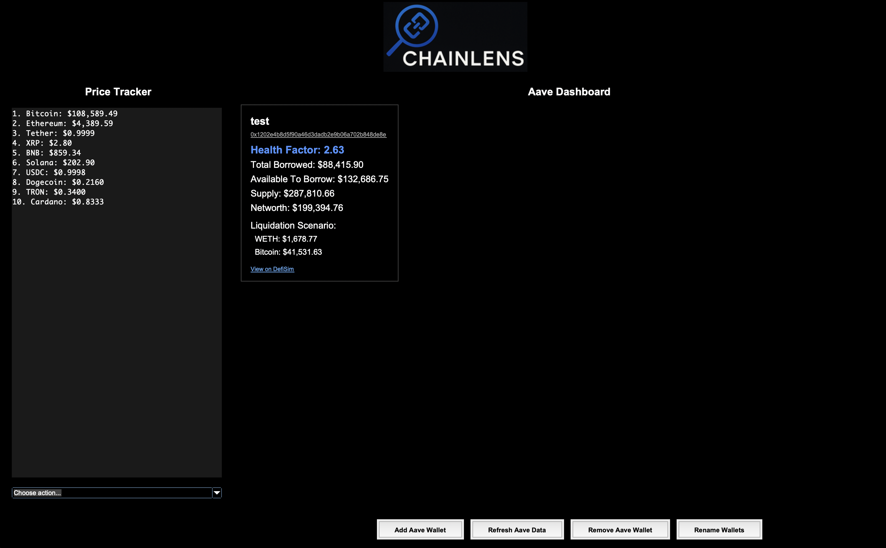
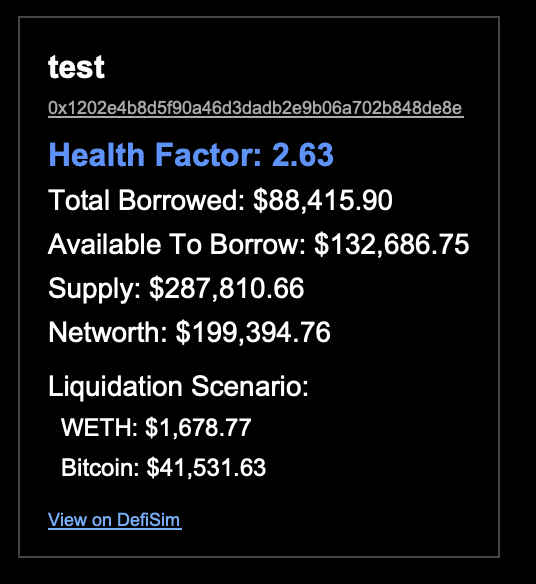
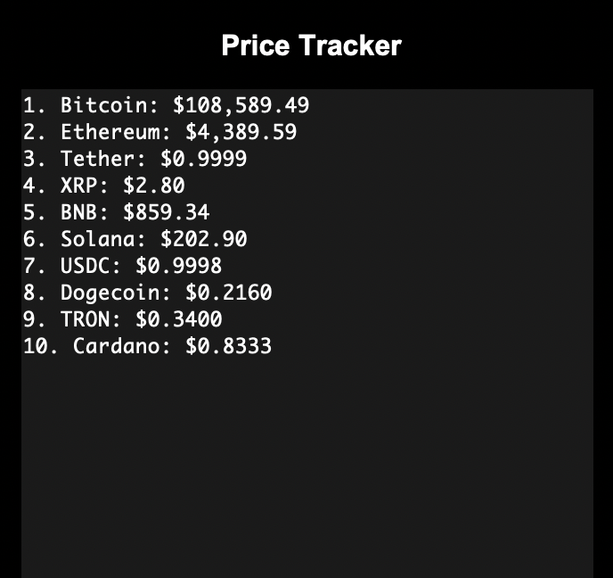

# Aave Wallet Tracker

This project provides a secure way to track multiple Aave wallets on the Polygon network through a local Python application. It displays important financial information in a modern GUI and refreshes data automatically at regular intervals.

## 📸 Screenshots

The application features a comprehensive dual-pane interface with cryptocurrency tracking and Aave wallet management:

### Main Dashboard Interface
A complete overview showing both cryptocurrency prices and Aave wallet data in an organized layout.



### Wallet Card Display
Individual wallet cards showing detailed Aave protocol data including Health Factor, borrowed amounts, liquidation scenarios, and more.



### Price Tracker Panel
Real-time cryptocurrency price tracking with support for Top 10, Top 50, and Top 100 coins from multiple exchanges.



## 🚀 Quick Start

### Version 2.0 (Recommended - API Edition)
The latest version uses APIs instead of web scraping for faster, more reliable data:

```bash
cd "dashboard interface/v2"
pip install -r requirements.txt
python3 Combined_Dashboard_v2.py
```

### Version 1.3 (Legacy - Browser Scraping)
For users who prefer the original browser-based approach:

```bash
cd "dashboard interface/v1.3"
pip install selenium cryptography pillow beautifulsoup4
python3 Combined_Dashboard_v1_3.py
```

## 📚 Features

### Core Functionality
- **Secure wallet storage**: Wallet addresses encrypted locally using Fernet encryption
- **Real-time tracking**: Live Aave protocol data from multiple sources
- **User-friendly GUI**: Modern interface with logo and card-based layout
- **Automatic refresh**: Data updates every 10 minutes
- **Cryptocurrency tracker**: Track custom coins plus top market rankings

### Displayed Metrics
- Health Factor (with color-coded risk levels)
- Total Borrowed
- Available to Borrow  
- Supplied Asset Value
- Net Asset Value (Net Worth)
- Liquidation Scenarios (when available)

## 🆚 Version Comparison

| Feature | v1.3 (Selenium) | v2.0 (API) |
|---------|-----------------|------------|
| **Data Source** | Web scraping defisim.xyz | Direct API calls |
| **Speed** | Slower (browser automation) | Instant (API responses) |
| **Dependencies** | Chrome, ChromeDriver, Selenium | Python libraries only |
| **Reliability** | Can break with website changes | Stable API contracts |
| **Resource Usage** | High (browser overhead) | Low (HTTP requests) |
| **Liquidation Data** | Available from scraping | Limited by API availability |

## 🔧 Technologies Used

### Version 2.0 (API Edition)
- **Python** — Main programming language
- **Tkinter** — GUI framework (built-in with Python)
- **Requests** — API calls to data sources
- **Cryptography** — Wallet encryption (Fernet, PBKDF2-HMAC)
- **PIL/Pillow** — Image processing for logo display
- **BeautifulSoup4** — Cryptocurrency price parsing

### Version 1.3 (Legacy)
- **Selenium** — Web automation for data scraping
- **Chrome/ChromeDriver** — Browser automation
- All v2.0 technologies plus browser dependencies

## 📦 Installation & Requirements

### For v2.0 (Recommended)
```bash
# Navigate to v2 directory
cd "dashboard interface/v2"

# Install dependencies
pip install requests cryptography pillow beautifulsoup4

# Run application
python3 Combined_Dashboard_v2.py
```

### For v1.3 (Legacy)
```bash
# Navigate to v1.3 directory  
cd "dashboard interface/v1.3"

# Install dependencies
pip install selenium cryptography pillow beautifulsoup4

# Ensure Chrome and ChromeDriver are installed and compatible
# Run application
python3 Combined_Dashboard_v1_3.py
```

### System Requirements
- **Python 3.7+** with tkinter (usually included)
- **Internet connection** for data fetching
- **Logo file**: `logo_raw_b64.txt` must be in the same directory as the main script

## 🔒 Security & Encryption

- **Fernet encryption** with PBKDF2-HMAC (SHA256) key derivation
- **Password-based security**: Your password encrypts all wallet data
- **Local storage only**: No data sent to external services except for protocol queries
- **Salt-based encryption**: Random salt generated for each encryption cycle
- **File structure**: 
  - `wallets.encrypted` — Your encrypted wallet addresses
  - `salt.bin` — Encryption salt (keep with encrypted file)

**⚠️ Security Warning**: If you lose your password, you lose access to stored wallets. Backup your password safely!

## 🗂️ Project Structure

```
aave_dashboard/
├── dashboard interface/
│   ├── v1/                          # Original version
│   ├── v1.3/                        # Enhanced with logo and features
│   │   ├── Combined_Dashboard_v1_3.py
│   │   ├── logo_raw_b64.txt
│   │   └── UPDATE.md
│   └── v2/                          # API Edition (Latest)
│       ├── Combined_Dashboard_v2.py
│       ├── aave_api.py
│       ├── requirements.txt
│       ├── logo_raw_b64.txt
│       └── README_v2.md
├── src/                             # Core scraping modules
│   └── Aave_Dashboard.py
├── screenshots/                     # Application screenshots  
└── README.md                        # This file
```

## 🌐 Data Sources

### Version 2.0 APIs
- **Primary**: expand.network API (Aave V3 Polygon data)
- **Fallback**: The Graph subgraphs (GraphQL queries)
- **Crypto prices**: CoinMarketCap, CoinRanking

### Version 1.3 Scraping
- **Aave data**: defisim.xyz (automated browser scraping)
- **Crypto prices**: CoinMarketCap, CoinRanking

## 🛠️ Usage Guide

### First-Time Setup
1. Run the application for your chosen version
2. Enter a secure password when prompted
3. Add your Aave wallet addresses via "Add Aave Wallet"
4. (Optional) Add cryptocurrency coins to track via the Price Tracker

### Daily Use
1. Launch the application
2. Enter your password to decrypt stored wallets
3. Data automatically loads and refreshes every 10 minutes
4. Use buttons to add/remove/rename wallets as needed

### Wallet Management
- **Add**: Click "Add Aave Wallet" → Enter address → Optional name
- **Remove**: Click "Remove Aave Wallet" → Select wallets to remove
- **Rename**: Click "Rename Wallets" → Edit names for organization

### Cryptocurrency Tracking
- **My Coins**: Track custom cryptocurrency prices
- **Top Lists**: View Top 10 (CMC), Top 50 (CR), Top 100 (CR)
- **Add/Remove**: Manage your tracked coin list

## 🎨 Interface Features

- **Dark theme** optimized for extended use
- **Color-coded Health Factors**: 
  - 🔴 Red: < 1.0 (High Risk)
  - 🟠 Orange: 1.0-1.5 (Medium Risk)  
  - 🟢 Green: 1.5-2.0 (Safe)
  - 🔵 Blue: > 2.0 (Very Safe)
- **Card-based layout** for easy wallet comparison
- **Responsive design** adapts to window size
- **Integrated logo** for professional appearance

## 🔄 Migration from v1.3 to v2.0

Your encrypted wallet files are fully compatible:

1. Copy `wallets.encrypted` and `salt.bin` from v1.3 to v2 directory
2. Copy `logo_raw_b64.txt` to v2 directory  
3. Install v2.0 requirements: `pip install -r requirements.txt`
4. Run v2.0 with the same password
5. Your wallets and settings transfer automatically

## 🆘 Troubleshooting

### Common Issues
- **"API Error"**: Check internet connection, try refreshing data
- **"Password incorrect"**: Ensure you're using the exact password from setup
- **"Logo Error"**: Verify `logo_raw_b64.txt` is in the same directory
- **Empty data**: Ensure wallet addresses are valid Ethereum addresses

### Version-Specific Issues
- **v1.3 Browser issues**: Update Chrome and ChromeDriver to compatible versions
- **v2.0 API limits**: Built-in fallback systems handle temporary API failures

### Performance Tips
- **v2.0**: Significantly faster, recommended for daily use
- **v1.3**: May be slower but provides liquidation scenario data
- **Auto-refresh**: Data updates every 10 minutes automatically

## 🛡️ License

This project is released under the **MIT License**.  
Feel free to use, modify, and distribute with proper attribution.

## 💬 Final Thoughts

This tool keeps you informed about your DeFi positions without connecting your wallet or putting assets at risk. You own your data, control your wallets, and your information stays encrypted on your machine.

**Move fast, stay safe, and may your Health Factor always be high! 🚀**

---

### 🔗 Links
- **Repository**: [https://github.com/paolacodes1/aave_dashboard](https://github.com/paolacodes1/aave_dashboard)
- **Issues**: Report bugs or request features via GitHub Issues
- **DeFi Simulator**: [https://defisim.xyz](https://defisim.xyz) (data source for v1.3)